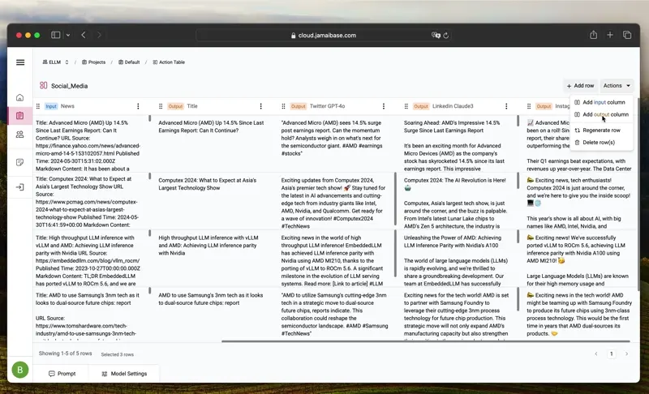

# JamAI Base

<!-- prettier-ignore-start -->

> [!TIP]
> [Explore our docs](#explore-the-documentation)

<!-- prettier-ignore-end -->

## Overview

JamAI Base is an open-source RAG (Retrieval-Augmented Generation) backend platform that integrates an embedded database (SQLite) and an embedded vector database (LanceDB) with managed memory and RAG capabilities. It features built-in LLM, vector embeddings, and reranker orchestration and management, all accessible through a convenient, intuitive, spreadsheet-like UI and a simple REST API.

## Key Features

- Embedded database (SQLite) and vector database (LanceDB)
- Managed memory and RAG capabilities
- Built-in LLM, vector embeddings, and reranker orchestration
- Intuitive spreadsheet-like UI
- Simple REST API

### Generative Tables

Transform static database tables into dynamic, AI-enhanced entities.

- **Dynamic Data Generation**: Automatically populate columns with relevant data generated by LLMs.
- **Built-in REST API Endpoint**: Streamline the process of integrating AI capabilities into applications.

### Action Tables

Facilitate real-time interactions between the application frontend and the LLM backend.

- **Real-Time Responsiveness**: Provide a responsive AI interaction layer for applications.
- **Automated Backend Management**: Eliminate the need for manual backend management of user inputs and outputs.
- **Complex Workflow Orchestration**: Enable the creation of sophisticated LLM workflows.

### Knowledge Tables

Act as repositories for structured data and documents, enhancing the LLM’s contextual understanding.

- **Rich Contextual Backdrop**: Provide a rich contextual backdrop for LLM operations.
- **Enhanced Data Retrieval**: Support other generative tables by supplying detailed, structured contextual information.
- **Efficient Document Management**: Enable uploading and synchronization of documents and data.

### Chat Tables

Simplify the creation and management of intelligent chatbot applications.

- **Intelligent Chatbot Development**: Simplify the development and operational management of chatbots.
- **Context-Aware Interactions**: Enhance user engagement through intelligent and context-aware interactions.
- **Seamless Integration**: Integrate with Retrieval-Augmented Generation (RAG) to utilize content from any Knowledge Table.

### LanceDB Integration

Efficient management and querying of large-scale multi-modal data.

- **Optimized Data Handling**: Store, manage, query, and retrieve embeddings on large-scale multi-modal data efficiently.
- **Scalability**: Ensure optimal performance and seamless scalability.

### Declarative Paradigm

Focus on defining "what" you want to achieve rather than "how" to achieve it.

- **Simplified Development**: Allow users to define relationships and desired outcomes.
- **Non-Procedural Approach**: Eliminate the need to write procedures.
- **Functional Flexibility**: Support functional programming through LLMs.

## Key Benefits

### Ease of Use

- **Interface**: Simple, intuitive spreadsheet-like interface.
- **Focus**: Define data requirements through natural language prompts.

### Scalability

- **Foundation**: Built on LanceDB, an open-source vector database designed for AI workloads.
- **Performance**: Serverless design ensures optimal performance and seamless scalability.

### Flexibility

- **LLM Support**: Supports any LLMs, including OpenAI GPT-4, Anthropic Claude 3, and Meta Llama3.
- **Capabilities**: Leverage state-of-the-art AI capabilities effortlessly.

### Declarative Paradigm

- **Approach**: Define the "what" rather than the "how."
- **Simplification**: Simplifies complex data operations, making them accessible to users with varying levels of technical expertise.

### Innovative RAG Techniques

- **Effortless RAG**: Built-in RAG features, no need to build the RAG pipeline yourself.
- **Query Rewriting**: Boosts the accuracy and relevance of your search queries.
- **Hybrid Search & Reranking**: Combines keyword-based search, structured search, and vector search for the best results.
- **Structured RAG Content Management**: Organizes and manages your structured content seamlessly.
- **Adaptive Chunking**: Automatically determines the best way to chunk your data.
- **BGE M3-Embedding**: Leverages multi-lingual, multi-functional, and multi-granular text embeddings for free.

## Getting Started

### Option 1: Use the JamAI Base Cloud

[Sign up for a free account!](https://cloud.jamaibase.com/) Did we mention that you can get free LLM tokens?

### Option 2: Launch self-hosted services

[Follow our step-by-step guide.](https://docs.jamaibase.com/sdk/python-sdk-documentation#oss)

### Explore the Documentation:

- [SDK and Platform Documentation](https://docs.jamaibase.com)
- [API Documentation](https://jamaibase.readme.io)
- [Changelog](CHANGELOG.md)
- [Versioning](VERSIONING.md)

## Examples

Want to try building apps with JamAI Base? We've got some awesome examples to get you started! Check out our [example docs](https://docs.jamaibase.com/getting-started/use-case) for inspiration.

Here are a couple of cool frontend examples:

1. [Simple Chatbot Bot using NLUX](https://docs.jamaibase.com/getting-started/quick-start/nlux-frontend-only): Build a basic chatbot without any backend setup. It's a great way to dip your toes in!
2. [Simple Chatbot Bot using NLUX + Express.js](https://docs.jamaibase.com/getting-started/quick-start/nlux-+-express.js): Take it a step further and add some backend power with Express.js.
3. [Simple Chatbot Bot using Streamlit](https://docs.jamaibase.com/sdk/python-sdk-documentation#streamlit-chat-app): Are you a Python dev? Checkout this Streamlit demo!

Let us know if you have any questions – we're here to help! Happy coding! 😊

## Community and Support

Join our vibrant developer community for comprehensive documentation, tutorials, and resources:

- **Discord**: [Join our Discord](https://discord.gg/rV6DECA8Dw)
- **GitHub**: [Star our GitHub repository](https://github.com/EmbeddedLLM/JamAIBase)

## Contributing

We welcome contributions! Please read our [Contributing Guide](Contributing_Guide_Link) to get started.

## License

This project is released under the Apache 2.0 License. - see the [LICENSE](https://github.com/EmbeddedLLM/JamAIBase/blob/main/LICENSE) file for details.

## Contact

Follow us on [X](https://x.com/EmbeddedLLM) and [LinkedIn](https://www.linkedin.com/company/embedded-llm/) for updates and news.
